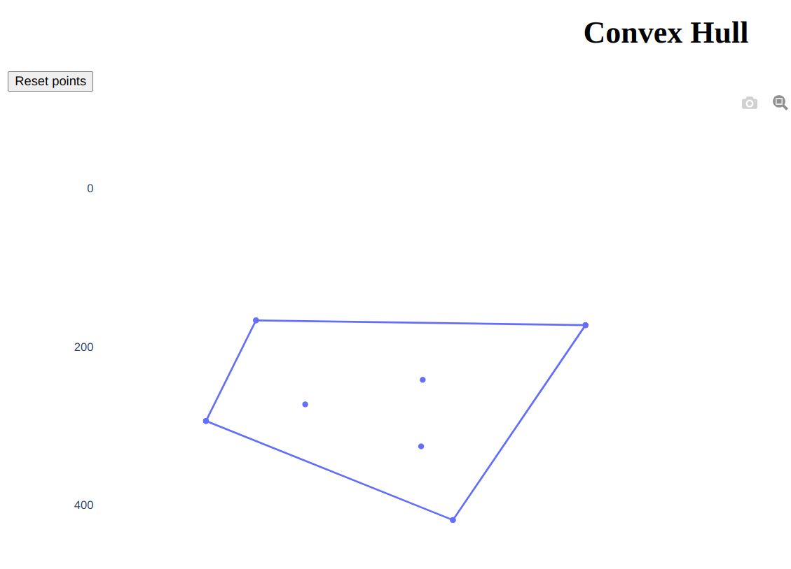

# Convex Hull

A simple playground for educational purposes, based on Dash framework. User adds points to a canvas, a convex hull for those points is computed and displayed.

## Instructions

1. Install `dash`, `opencv-python`, and maybe some other required libraries;
2. `python3 app.py`;
3. Follow a link from the command line.

